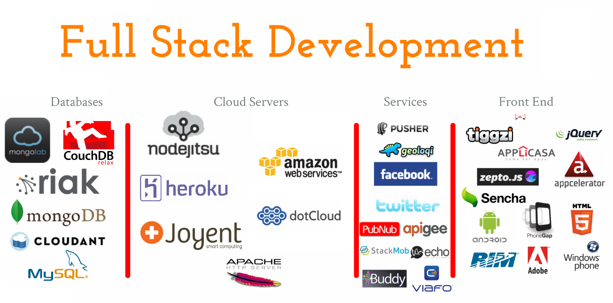

## syam.github.in
## 1. SALES REPRESENTATIVES: 
* Job type:  **Full time**                 
* Location:  **Anywhere**
* Company size: **10-50**
* Remote only                                                            
### Qualifications:
* Candidate must have atleast **5** years of experience
* Writes and speaks fluent **English**  
* Extremly **well organised**
* **Emphatic & kind**
* Extensive experience in doing **B2B** sales....

## 2.REMOTE FULLSTACK DEV:    
* Job type: **Full time**
* Location: **Anywhere**
* Company size: **10-21**
* **Remote first**
### Qualifications:
* Experience with **modern front-end JS** especially with a framework like React, Vue, Backbone, or Angular.
* Experience integrating with backend data stores such as ***third party APIs or databases*** like ***PostgreSQL or MongoDB.***
* A preference for***writing quality code with tests*** and leaving the code base better than how you found it.
* Experience continuously ***delivering and debugging production code.***
* Comfortable ***communicating with engineers, clinical, and operations staff*** to solve open-ended problems.
* Interest in doing***mission-oriented work*** especially in the healthcare space.
* Experience at a ***fast-paced environment like a startup***.
* Maintained security initiatives such as ***penetration testing or bug bounty programs.***
* Database administration skills in***RDMBS or NoSQL technologies*** and a solid grasp of SQL.  
* A formal programming education ***(e.g. coding bootcamp, CS degree, technical certification, etc.).***
* Experience working with ***healthcare data, healthcare technology, and clinical staff.***

## 3.Senior Python / Django Engineer:
Job type: **Full time**
Location: **Anywhere**
Company size: **1-10**
### Qualifications:
* **3+ years of professional Python experience** with either **Django or Flask**
* Expert in ***Docker and managing Docker infrastructures***
* Expert in ***Git, Continuous Integration & Delivery***
* ***Speak linux natively***
* ***Strong written and oral communication skills***
* Comfort ***working remotely -- independent & self-motivated***

#### Benefits:
*  ***Competitive salary + Equity***
*  ***Unlimited vacation***
*  ***Health/Dental/Vision***
*  ***Small team of exceptional engineers + project managers***
*  ***Opportunity to join a growing business and leave your fingerprint on it's success***
*  ***Collaborative, transparent and fun loving office culture***

*  Art By **~~Syam Kumar~~**
